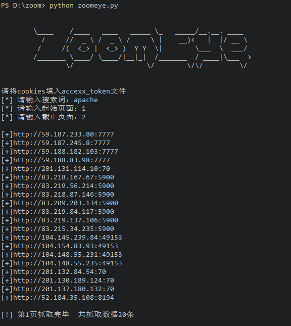
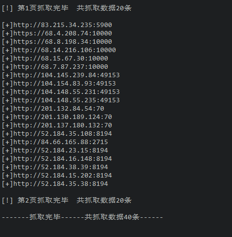

# zoomeye_get_urls_without_api

useage: python3 zoomeye_get_url_without_api.py

zoomeye注册自带10000条api数据可拉取，但很快就被挥霍完了。所以，急需这个不需要api拉取数据的东东。

使用方法很简单：python3 zoomeye_get_url_without_api.py

然后输入要查询的关键词，再输入拉取数据的起始页面和截止页面。

ok了

目前存在的bug：

测试还不够多，自己用了几把，感觉还可以。
zoomeye的urlencode方式和python的不太一致，有时候关键词复杂的情况下，会出现拉取不出数据，主要是url编码与zoomeye不一致了。这个目前正在不断尝试。如果有人知道规律，可以issues。
